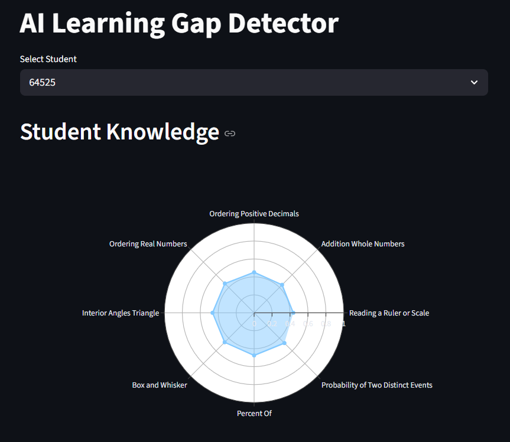
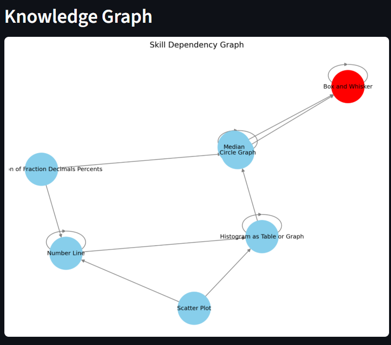

# AI Learning Gap Detector

An AI system that detects **learning gaps in students** using **Deep Knowledge Tracing (LSTM)** and real educational interaction data.

The system analyzes sequences of student answers, predicts student knowledge across different skills, identifies weak areas, and recommends the **next best skills to practice**.

This project demonstrates how machine learning can be applied to **adaptive learning systems**, similar to those used in modern educational platforms.

---

# Project Overview

Students often move forward in the curriculum without fully understanding earlier concepts.
These hidden knowledge gaps cause difficulties in later topics.

This project builds an AI pipeline that:

• Models student knowledge using **Deep Knowledge Tracing (LSTM)**
• Detects **learning gaps** in student understanding
• Builds a **skill dependency graph**
• Recommends **next skills to practice**
• Visualizes results through an **interactive dashboard**

---

# System Architecture

Student Interaction Data
↓
Deep Knowledge Tracing (LSTM)
↓
Knowledge State Prediction
↓
Learning Gap Detection
↓
Adaptive Skill Recommendation
↓
Interactive Dashboard

---

# Dataset

This project uses the **ASSISTments educational dataset**, which contains real student learning interactions.

Dataset characteristics:

• ~400,000+ student interactions
• Student answers to math questions
• Skill labels for each problem
• Correct / incorrect responses

The dataset is widely used in **Educational Data Mining research**.

---

# Deep Knowledge Tracing Model

The system implements **Deep Knowledge Tracing (DKT)** using an LSTM neural network.

The model learns to estimate the probability that a student knows a skill:

P(student knows skill)

Given a sequence of student interactions, the model predicts the probability that the student has mastered each skill.

Example predictions:

Histogram → 0.82
Scatter Plot → 0.64
Box and Whisker → 0.31

Skills with low mastery are considered **learning gaps**.

---

# Learning Gap Detection

Learning gaps are detected when predicted skill mastery falls below a threshold.

Example:

Skill Mastery

Box and Whisker → 0.31
Scatter Plot → 0.28

These skills are flagged as concepts the student likely struggles with.

---

# Adaptive Skill Recommendation

Based on detected gaps, the system recommends the **next best skills to practice**.

Example:

Next Best Skills to Practice

• Reading a Ruler or Scale
• Addition Whole Numbers
• Ordering Positive Decimals

This creates a simple **adaptive learning loop**:

Predict knowledge → Detect gaps → Recommend practice

---

# Knowledge Graph

The system builds a **skill dependency graph** representing prerequisite relationships between skills.

Weak skills are highlighted in the graph to visualize where the student struggles within the skill hierarchy.

---

# Dashboard

The project includes an interactive **Streamlit dashboard**.

Features:

• Student selection
• Radar chart of skill mastery
• Learning gap detection
• Adaptive skill recommendations
• Knowledge dependency graph

---

# Dashboard Examples

### Student Knowledge Visualization



---

### Adaptive Skill Recommendations


---

### Skill Dependency Graph



---

# Installation

Clone the repository:

```bash
git clone https://github.com/Arseniiiii-ai/learning-gap-ai.git
cd learning-gap-ai
```

Install dependencies:

```bash
pip install -r requirements.txt
```

---

# Requirements

The project uses the following Python libraries:

```
pandas
numpy
torch
streamlit
plotly
networkx
matplotlib
scikit-learn
```

---

# Training the Model

Train the Deep Knowledge Tracing model:

```bash
python -m models.train_dkt
```

The trained model will be saved to:

```
models/dkt_model.pth
```

---

# Running the Dashboard

Start the interactive dashboard:

```bash
streamlit run dashboard/app.py
```

Then open in your browser:

```
http://localhost:8501
```

---

# Project Structure

```
learning-gap-ai
│
data/                  # dataset location
src/                   # ML pipeline and utilities
models/                # deep learning model and training
dashboard/             # Streamlit dashboard
docs/                  # images used in README
requirements.txt
README.md
.gitignore
```

---

## Dataset

This project uses the **ASSISTments 2009-2010 dataset**.

Due to GitHub file size limits, the dataset is not included in this repository.

Download the dataset from:

https://sites.google.com/view/assistmentsdata/home

Then place the file inside the `data/` folder:

data/
 └ assistments.csv

---


# Technologies Used

Python
PyTorch
Pandas
NumPy
Streamlit
Plotly
NetworkX
Matplotlib

---

# Applications

This project demonstrates how AI can be applied to:

• Adaptive learning systems
• Personalized education
• Educational data mining
• Intelligent tutoring systems

---

# Future Improvements

Possible extensions:

• Question-level recommendation
• Transformer-based knowledge tracing
• Knowledge graph learning
• AI tutor explanations using LLMs

---

# Author

Arsen Baktygaliyev

Machine Learning enthusiast interested in **Educational AI and Adaptive Learning Systems**.

GitHub:
https://github.com/Arseniiiii-ai
